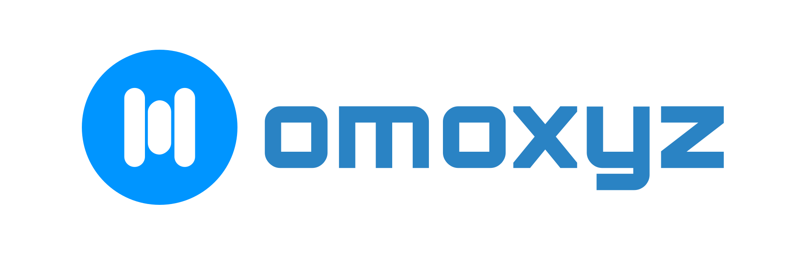

# Omoxyz

**Technology You Deserve**  

Omoxyz is dedicated to building **open-source, self-hosted software** that empowers individuals, developers, and organizations to own their data, maintain privacy, and run secure, reliable systems. Our projects are designed to be **flexible, scalable, and production-ready** while remaining completely free and open-source.

---

## 📂 Why Open-Source & Self-Hosted?

- **Full Ownership:** Keep your data private and secure.  
- **Customizable:** Tailor software to your exact needs.  
- **No Vendor Lock-in:** Run it anywhere, on your terms.  
- **Community-Driven:** Collaborate, contribute, and grow with others.  

---

## 🤝 Get Involved

We welcome **contributors, testers, and advocates**! Whether you're a developer, sysadmin, or just passionate about open-source, there’s a place for you in the Omoxyz community.  

[Explore our projects](https://github.com/omoxyz)

---

## 🌐 Connect with Us

- Website: [omoxyz.com](https://omoxyz.com)
- GitHub: [github.com/omoxyz](https://github.com/omoxyz)

---

**Join us in building the future of self-hosted software!**
